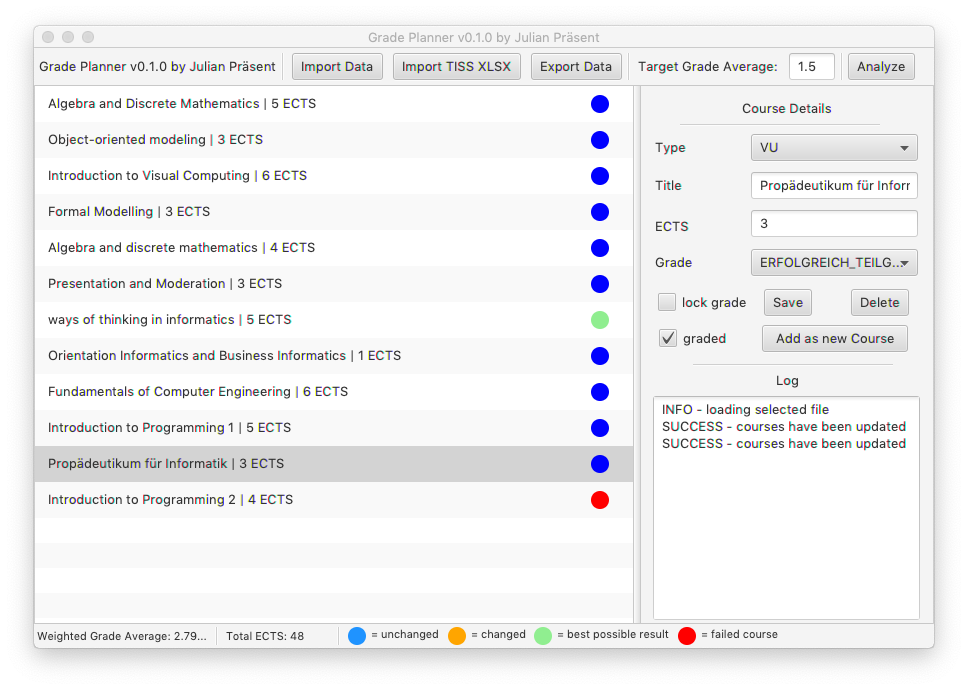
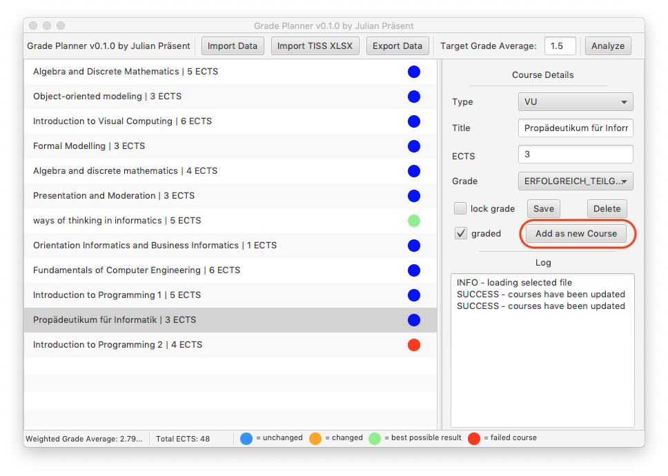
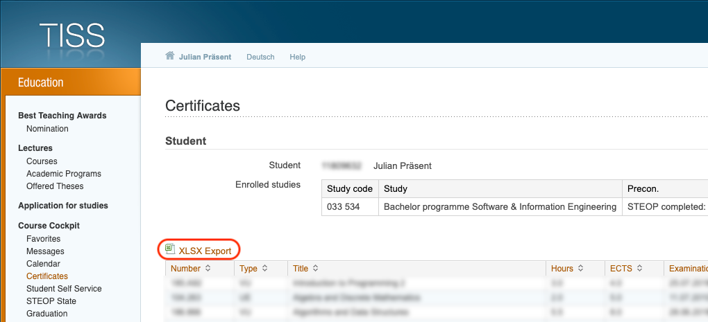
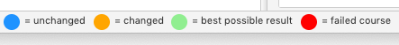

<h1 align="center">Project GradePlanner</h1>
<p>
  
  <a href="https://www.gnu.org/licenses/gpl-3.0.de.html">
    
  </a>
</p>

> Program for optimizing university courses in order to reach a certain weighted grade average as &#34;easy&#34; as possible. <br>
The program was initially created for students of the Technical University of Vienna (aka TU Wien) but can be used by any student really. <br>
Although grading systems, course types and the app language is designed to be used by students of the TU Wien all of these things can be adapted if the demand arises (see section "Contributing") <br>



## Prerequisites

* Java Runtime Environment 11 or higher

## Usage
open a terminal / cmd in the root directory and type the following:

```sh
java -jar GradePlanner-1.0.0.jar
```

## Features

### Create new courses
The application was designed as a single page application, therefore the creation of courses is integrated into the detail view section. <br>
Simply fill in the data and click the highlighted button. <br>


### Import / Export data
Data can be imported and exported as CSV files via the accordingly named buttons. Please be aware that manually editing the exported file can cause problems when importing the file. <br>
The exported file has the following data structure (example given): <br>
```java
ID;Course Title;Type;ECTS;Grade;Graded;Locked;Modified
```
```java
c3b62dcf-0883-40ba-8589-fb236fa74e49;Test Course 1;VU;10;GENUEGEND;false;false;false
5d4cc316-e76e-4cde-bb31-0a8f50687f47;Test Course 2;VU;10;SEHR_GUT;false;false;false

```

### Import TISS data
Students from the TU Wien can easily import their already certified courses. In order to to so, the XLSX from the TISS platform has to be downloaded and imported via the application.


### Analysis and Color Coding
After a target weighted grade average was entered the analysis and optimization process of the courses can be started by clicking the button "Analyze" in the top right corner. <br>
This process might take some time and will update the list of courses and log a message once it is finished. All courses are color coded in the following way: 


## Author

👤 **Julian Präsent**

* Github: [@Shippeyy](https://github.com/Shippeyy)
* Website: [jpraesent.com](https://jpraesent.com)

## Contributing

Contributions, issues and feature requests are welcome.
Feel free to check the [issues page](https://github.com/Shippeyy/GradePlanner/issues) if you want to contribute.

Give a ⭐️ if this project helped you!

## 📝 License

Copyright © 2019 [Julian Präsent](https://github.com/Shippeyy).<br />
This project is [GNU General Public License v3.0](https://www.gnu.org/licenses/gpl-3.0.de.html) licensed.