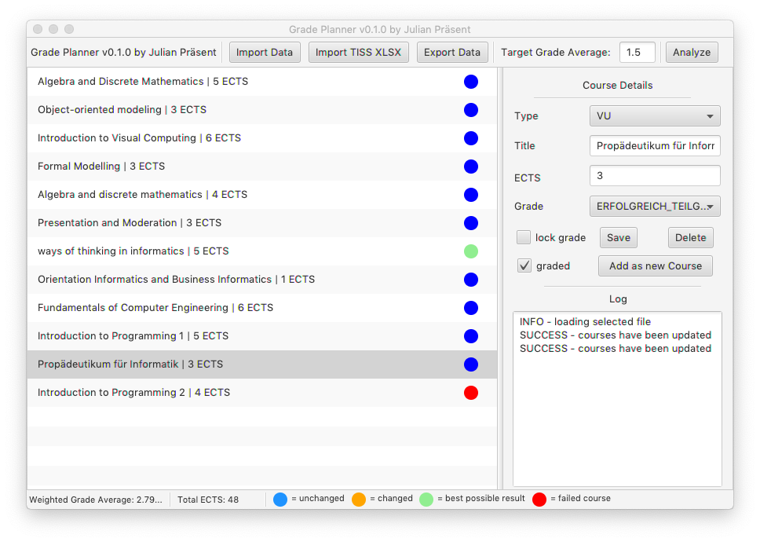

<h1 align="center">Project GradePlanner</h1>
<p>
  
  <a href="https://www.gnu.org/licenses/gpl-3.0.de.html">
    
  </a>
</p>

> Program for optimizing university courses in order to reach a certain weighted grade average as &#34;easy&#34; as possible. <br>
The program was initially created for students of the Technical University of Vienna (aka TU Wien) but can be used by any student really. <br>
Although grading systems, course types and the app language is designed to be used by students of the TU Wien all of these things can be adapted if the demand arises (see section "Contributing") <br>



## Prerequisites

* Java Runtime Environment 11 or higher

## Usage

```sh
java -jar GradePlanner.jar
```

## Features

### Create new courses

### Update / Delete courses

### Import / Export data

### Import TISS data

### Analysis and Color Coding

## Author

👤 **Julian Präsent**

* Github: [@Shippeyy](https://github.com/Shippeyy)
* Website: [jpraesent.com](https://jpraesent.com)

## Contributing

Contributions, issues and feature requests are welcome.
Feel free to check the [issues page](https://github.com/Shippeyy/GradePlanner/issues) if you want to contribute.

Give a ⭐️ if this project helped you!

## 📝 License

Copyright © 2019 [Julian Präsent](https://github.com/Shippeyy).<br />
This project is [GNU General Public License v3.0](https://www.gnu.org/licenses/gpl-3.0.de.html) licensed.